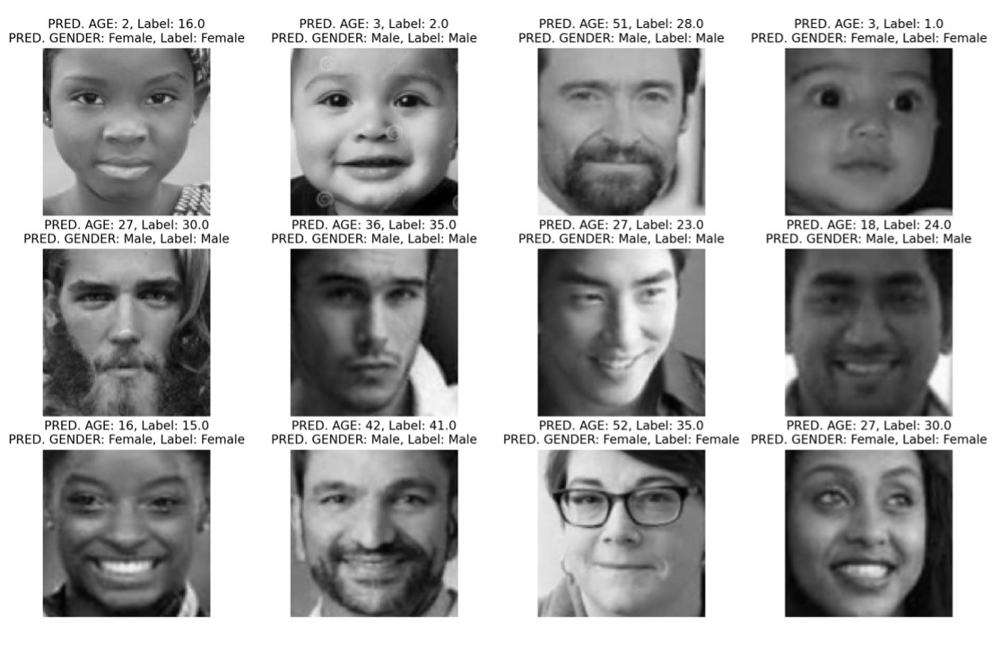

# Gender Classification
CNN classifier to predict age and gender of a face.

## Dependencies:

 - Numpy
 - PIL
 - Matplotlib
 - Random
 - Tensorflow
 - Keras

## Installation:

 1. Clone the genderClassification repository to your local machine using `git clone https://github.com/benekeneb/genderClassification.git`
 2. In order to train the CNN you need to download the dataset UTKFace (Source: https://susanqq.github.io/UTKFace/). The easiest way to do that is to clone the following repository into your local genderClassification folder. `git clone https://github.com/ongteckwu/utkface.git`
 3. Create virtual environment with the modules I listed above.

## Project description

 - **`webcam.py`**: Script which uses your webcam to classify visible faces. Start the `webcam.py` in the main directory to predict both age and gender. There are also `webcam.py` scripts in the `age_classification` and the `gender_classification` directories to just predict one thing.
 - **`evaluate_train.py`**: Script to plot some example images from the dataset with the associated predicted labels by my models. Can also be found in  the `age_classification` and the `gender_classification` directories. Example is `evaluate_train_plot.png`
 - **`plot_histograms.py`**: Script to plot histograms of the used dataset.
 - To train the two models there are `train.py` scripts in both the  `age_classification` and the `gender_classification` directories.
